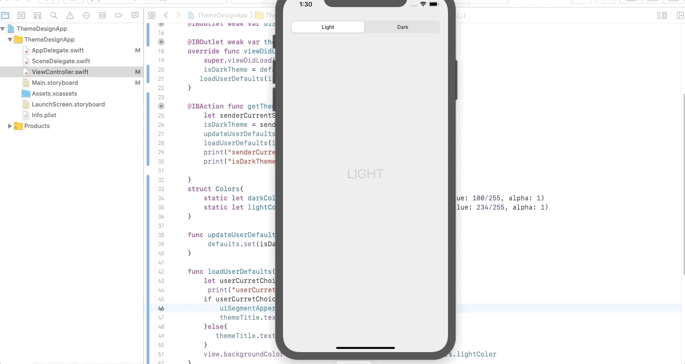
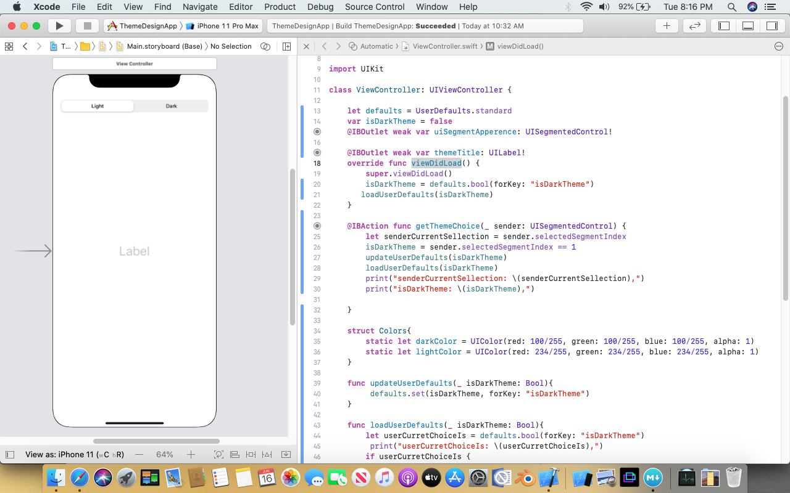

# UserDefaults

## Our Goal

User degaults help us to store data into an info.plish file
## What you will create

We will create a apps which contains a segment controller. On click SegmentController index, our UIView will be change and the information will be saved into user defaults, One restart the apps the last information will be displayed.
## What you will learn

* UISegmentedControl
* UserDefaults
* Structure with Colors propertise 


## Let's Learn

Create New Project
Drag and Drop a UISegmentController into Storyboard
Set Horizontally Center and ypper to 20, left 20, rgith 20 constraint. add lebel and set horizontally and vertically center


create two outlet of SegmentController one as Label and another as action, create another label outlet of our Label.

User defults
Initialization, Create value, Call value

```swift
    let defaults = UserDefaults.standard
    defaults.set(isDarkTheme, forKey: "isDarkTheme")
    defaults.bool(forKey: "isDarkTheme")
```

Create a function loadUserDefaults which will fetch user previous choice from user defaults, according to the user choice Label text and view background will be loaded.

```swift
 func loadUserDefaults(_ isDarkTheme: Bool){
        let userCurretChoiceIs = defaults.bool(forKey: "isDarkTheme")
         print("userCurretChoiceIs: \(userCurretChoiceIs),")
        if userCurretChoiceIs {
            uiSegmentApperence.selectedSegmentIndex = 1
            themeTitle.text = "DARK"
        }else{
           themeTitle.text = "LIGHT"
        }
        view.backgroundColor = isDarkTheme ? Colors.darkColor : Colors.lightColor
    }
```
    
Create another function updteUserDefaults, this function will update user defaults database.

```swift
  func updateUserDefaults(_ isDarkTheme: Bool){
         defaults.set(isDarkTheme, forKey: "isDarkTheme")
    }
```
  
Now we will create a structure with two different UI Color propertise

```swift
struct Colors{
        static let darkColor = UIColor(red: 100/255, green: 100/255, blue: 100/255, alpha: 1)
        static let lightColor = UIColor(red: 234/255, green: 234/255, blue: 234/255, alpha: 1)
    }
```  

Follow of Code

1. First of all we call loadUserDefaults function from viewDidLoad function, it will load our current choice if any esle defult
2. Now we will same loadUserDefaults function under our segment action function, which will load the function according to user choice, and finally we will call updateUserDefaults under the same action function which will update UserDefautls Database

Note
For finding physicall info.plist of UserDefults data just add the following line of code under AppDelegate class

```swift
func application(_ application: UIApplication, didFinishLaunchingWithOptions launchOptions: [UIApplication.LaunchOptionsKey: Any]?) -> Bool {
        //UserDefaults: Print UD URL
        print(NSSearchPathForDirectoriesInDomains(.documentDirectory, .userDomainMask, true).last! as String)
        return true
    }   
```

>Check out the full course and more at 

[www.joyonlineschool.com](https://www.joyonlineschool.com/)


